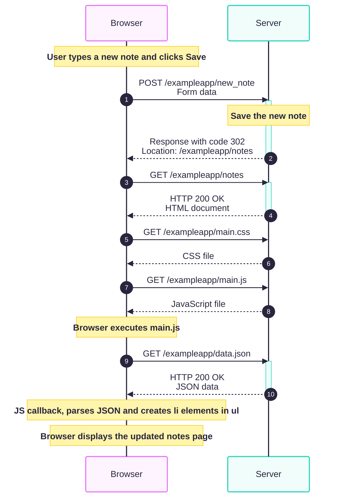

# Exercise 0.4

```mermaid
---
config:
  theme: redux-color
---
sequenceDiagram
    autonumber
    participant Browser
    participant Server

    Note over Browser: User types a new note and clicks Save

    Browser->>Server: POST /exampleapp/new_note<br/>Form data
    activate Server
    Note over Server: Save the new note
    Server-->>Browser: Response with code 302<br/>Location: /exampleapp/notes
    deactivate Server

    Browser->>Server: GET /exampleapp/notes
    activate Server
    Server-->>Browser: HTTP 200 OK<br/>HTML document
    deactivate Server

    Browser->>Server: GET /exampleapp/main.css
    Server-->>Browser: CSS file

    Browser->>Server: GET /exampleapp/main.js
    Server-->>Browser: JavaScript file

    Note over Browser: Browser executes main.js

    Browser->>Server: GET /exampleapp/data.json
    activate Server
    Server-->>Browser: HTTP 200 OK<br/>JSON data
    deactivate Server

    Note over Browser: JS callback, parses JSON and creates li elements in ul
    Note over Browser: Browser displays the updated notes page
```