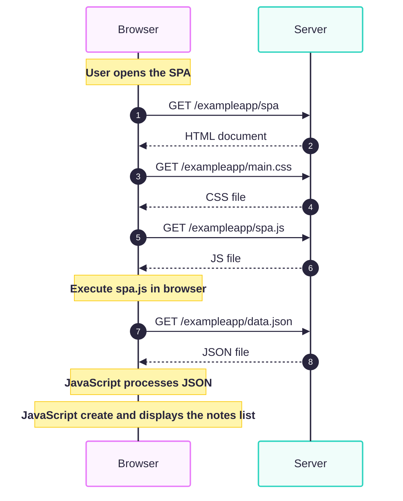

# Exercise 0.5

```mermaid
---
config:
  theme: redux-color
---
sequenceDiagram
    autonumber
    participant Browser
    participant Server

    Note over Browser: User opens the SPA

    Browser->>Server: GET /exampleapp/spa
    Server-->>Browser: HTML document

    Browser->>Server: GET /exampleapp/main.css
    Server-->>Browser: CSS file

    Browser->>Server: GET /exampleapp/spa.js
    Server-->>Browser: JS file

    Note over Browser: Execute spa.js in browser

    Browser->>Server: GET /exampleapp/data.json
    Server-->>Browser: JSON file

    Note over Browser: JavaScript processes JSON
    Note over Browser: JavaScript create and displays the notes list
```