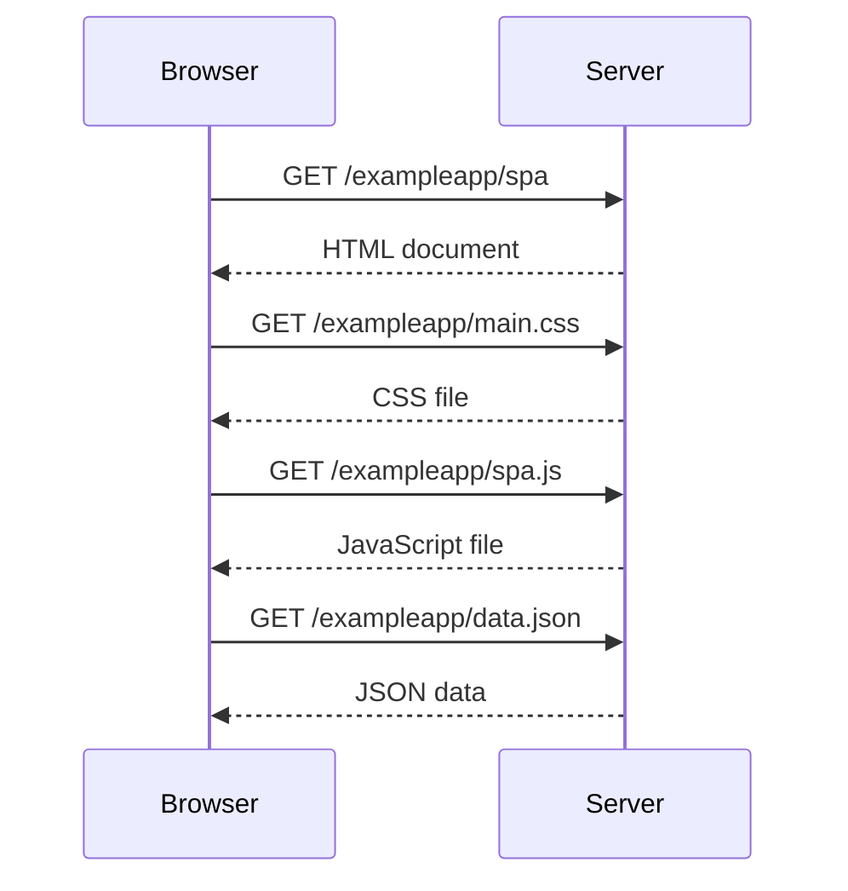

# Exercise 0.5

```mermaid
sequenceDiagram
    participant Browser
    participant Server

    Browser->>Server: GET /exampleapp/spa
    Server-->>Browser: HTML document

    Browser->>Server: GET /exampleapp/main.css
    Server-->>Browser: CSS file

    Browser->>Server: GET /exampleapp/spa.js
    Server-->>Browser: JavaScript file

    Browser->>Server: GET /exampleapp/data.json
    Server-->>Browser: JSON data
```